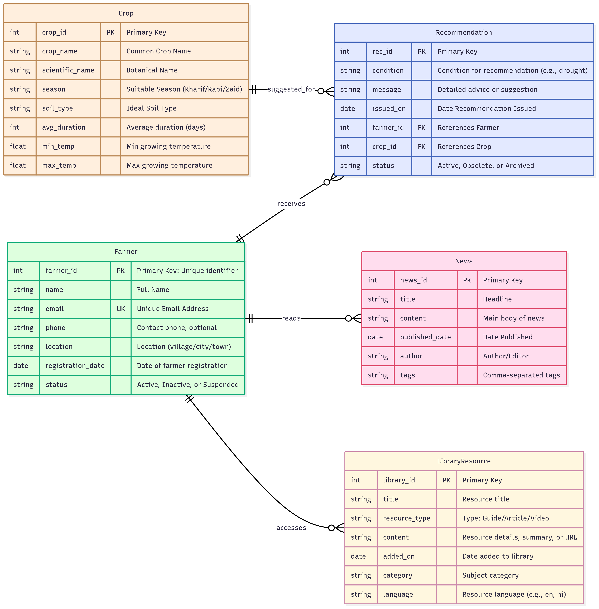

# 🌾 Farmer Helper

[](LICENSE)


**Farmer Helper** is a lightweight **web-based application** built with **HTML, CSS, & JavaScript** to assist farmers with essential agricultural information.  
It provides **crop recommendations**, agricultural **news updates**, and access to an **information library** to help farmers make better decisions.

---

## 🚀 Features

- 🌱 **Crop Recommendations** – Get suitable crop suggestions based on conditions.  
- 📰 **Agricultural News** – Stay updated with recent farming news.  
- 📚 **Knowledge Library** – Access guides, articles, and resources.  
- 🏠 **Simple Home Page** – Easy navigation across tools.  
- 🎨 **Responsive UI** – Clean design using CSS.  
- ⚡ **Lightweight** – Static HTML + JS, runs directly in any browser.  

---

## 🛠️ Tech Stack

- **Frontend:** HTML5, CSS3, Vanilla JavaScript  
- **UI Styling:** Custom CSS  
- **Execution:** Browser-based (no backend needed)  

---

## 📂 Project Structure

```
farmer-helper/
├── index.html         # Homepage
├── croprecom.html     # Crop recommendation page
├── library.html       # Farmer resource library
├── news.html          # Agricultural news page
├── app.js             # JavaScript functionality
├── style.css          # Stylesheet
├── style1.css         # Additional styling
├── LICENSE            # MIT License
└── README.md          # Documentation
```

---

## ⚙️ How to Run Locally

1. Clone this repository:
   ```bash
   git clone https://github.com/DhruvKhassa/farmer-helper.git
   cd farmer-helper
   ```

2. Open `index.html` in any **modern web browser**.  
   > No server needed, fully static project.  
   > For better developer experience: open with **VSCode Live Server**.

---

## 📸 Screenshots

📌 *(Replace placeholders with actual screenshots when project runs)*  

| Home Page | Crop Recommendation | News Feed | Library |
|-----------|----------------------|-----------|----------|
|  |  |  |  |

---

## 📊 ER Diagram

The core data model for **Farmer Helper** consists of Farmers, Crops, Recommendations, News, and Library Resources.  




---

## 📜 License
This project is licensed under the [MIT License](LICENSE).

---

## 👨‍💻 Author
- **Dhruv Khassa**  
  [GitHub](https://github.com/DhruvKhassa) · [LinkedIn](#)

---

✨ Farmer Helper → A small tool, a big impact for farmers 🌱
